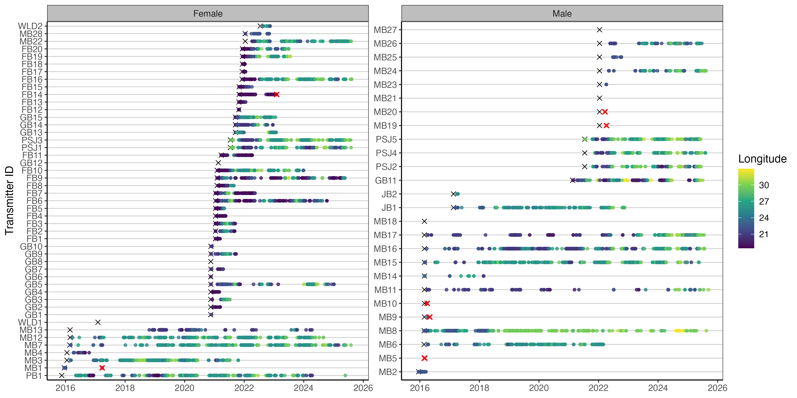

---
title: "ATAP Workshop: Exploratory Figures"
---

```{r setup, include=FALSE}
knitr::opts_chunk$set(
  echo = TRUE,
  message = FALSE,
  warning = FALSE
)
```

# Exploratory figures

Question? What are the first results that generally appear in the telemetry literature?

Usually an abacus plot:



And a summary table which gives useful biometrics and stats per individual for the reader:


It seems basic, but well presented opening tables and figures set the tone for the rest of the paper.

```{r load-packages}
pacman::p_load(tidyverse, lubridate, janitor, stringr, viridis, flextable, officer, geosphere, leaflet, sf)
rm(list = ls()) # start with a fresh and clean environment 
```

# Load cleaned data

Load your detections, biometrics, receivers and release sites.

Remember that the datasets we've cleaned broadly stem from ATAP outputs. If you source data direct form VUE/Fathom or your own database then you'll just need to spend a bit of time rejigging column names. But this should give you the bones you need to play with code and figure out what works for your data. Similarly to use more applied packages like {VTrack}, {actel}, {rsp}, {GLATOS}, {flapper} and many more you'll need to read up on package vignettes with how to format your data so that the packages will accept them.

But it is useful to work through some of these examples and tweak them using your own data at a later date.

```{r load-data}
detections <- read_csv("data/detections_clean.csv")
lubridate::tz(detections$timestamp)
sprintf(
  "There are %s detections in the dataset.",
  nrow(detections)
)
```

The timezone was converted to SAST in the cleaning workflow, but this was not retained in the csv, so force it rather than reconverting.

```{r force-detection-timezone}
detections <- detections %>% 
  mutate(
    timestamp = force_tz(
      timestamp,
      tzone = "Africa/Johannesburg"
    ), # remember we converted to SAST in the cleaning so needs forcing
    transmitter = as.character(transmitter)
  ) %>% 
  mutate(detectday = as.Date(timestamp)) %>% ## remove time to only include > 1 detection on any receiver per day
  group_by(detectday, transmitter) %>% 
  filter(n() > 1) %>% 
  ungroup() %>% 
  select(-detectday)
lubridate::tz(detections$timestamp)
sprintf(
  "There are %s detections in the dataset.",
  nrow(detections)
)
```

False detection filtering can be much more refined, especially for more resident species on smaller arrays. For example, a common rule is to require at least two detections within a defined time window, such as one hour, either at the same receiver or within the same local receiver group. At the scale of this regional array, and for the purposes of this workshop, we use a simple conservative filter: remove transmitter-days with only one detection anywhere on the array. This can also be more applicable for wide-ranging nomadic species.

# Speed filter

Another method of removing false detections is by using a speed filter. Many packages can do this for you but we can do a quick and dirty approach to highlight potentially unreasonable detection intervals or speeds between consecutive detections.

```{r speed-filter}
# define a conservative speed threshold for flagging unusual movements
max_speed_kmh <- 3
# similar to how we've worked with the receivers we use lags between consecutive detections
# to understand the time difference between each detection relative to each 
# transmitter 
detections_speed <- detections %>% 
  arrange(transmitter, timestamp) %>% 
  group_by(transmitter) %>% 
  mutate(
    previous_timestamp = lag(timestamp),
    previous_station = lag(station_name),
    previous_latitude = lag(latitude),
    previous_longitude = lag(longitude),
    time_diff_hours = as.numeric(
      difftime(timestamp, previous_timestamp, units = "hours")
    ),
    # using the geosphere package we can conservatively estimate the shortest path between 
    # two receivers in km
    distance_km = geosphere::distHaversine(
      cbind(previous_longitude, previous_latitude),
      cbind(longitude, latitude)
    ) / 1000,
    # simple speed = dist / time calc    
    speed_kmh = distance_km / time_diff_hours,
    # use logical statements to see whether there are wierd things going on    
    possible_false_detection =
      is.finite(speed_kmh) &
      speed_kmh > max_speed_kmh &
      distance_km > 5 # filter to remove overlapping receiver ranges this can also be tweaked
  ) %>% 
  ungroup() %>% 
  filter(possible_false_detection) %>% 
  arrange(desc(speed_kmh))
```

Lets inspect the speed calculations.

```{r inspect-speed-filter}
detections_speed %>% 
  select(station_name, previous_station, time_diff_hours, distance_km, speed_kmh) %>% 
  arrange(desc(speed_kmh)) %>% 
  print(n = 20)
```

While there are a few instances of fast swim speeds above our threshold, the receivers are relatively close to one another so there isn't too much concern here. Again this is a relatively quick and dirty approach but you can tweak these to test for unrealistically quick and far detections that you can identify for removal. Another key removal criteria is to remove any detections you have for that transmitter prior to it's release date or after a known mortality date.

```{r load-other-clean-data}
biometrics <- read_csv("data/biometrics_clean.csv")
biometrics <- biometrics %>% 
  mutate(transmitter = as.character(transmitter))
receivers <- read_csv("data/receiver_effort_clean.csv")
```

Force the same timezone for receivers.

```{r force-receiver-timezone}
receivers <- receivers %>% 
  mutate(
    effort_start = lubridate::force_tz(
      effort_start,
      tzone = "Africa/Johannesburg"
    ),
    effort_end = lubridate::force_tz(
      effort_end,
      tzone = "Africa/Johannesburg"
    )
  )
lubridate::tz(receivers$effort_start)
lubridate::tz(receivers$effort_end)
release <- read_csv("data/release_clean.csv")
```

# Abacus plots

Lets plot a few standard telemetry plots. The go to is usually an abacus plot of your detections.

```{r first-abacus}
ggplot()+
  geom_point(data = detections, aes(x = timestamp, y = transmitter))
```

Cool first abacus plotted, but it is a bit boring, and this is the power of ggplot, R and all the customisation you can do to get the perfect plot for your thesis or manuscript. We can build in some aesthetics to make the plot pop a bit.

```{r styled-abacus}
ggplot()+
  geom_point(data = detections, aes(x = timestamp, y = transmitter))+
  theme_bw() +
  theme(
    panel.background = element_blank(),
    panel.grid.major.y = element_line(colour = "grey", linewidth = 0.3),
    # panel.grid.minor.y = element_blank(),
    # panel.grid.major.x = element_blank(),
    panel.grid.minor.x = element_blank(),
    #axis.line = element_line(colour = "black"),
    strip.background = element_rect(fill = "grey"),
    text = element_text(size = 12)
  )+
  labs(x = "Date",
       y = "Shark ID") ## customise your labels
```

Still kinda boring though.

```{r longitude-abacus}
ggplot()+
  geom_point(data = detections, aes(x = timestamp, y = transmitter, colour = longitude))+
  scale_colour_viridis_c(name = "Longitude") +
  theme_bw() +
  theme(
    panel.background = element_blank(),
    panel.grid.major.y = element_line(colour = "grey", linewidth = 0.3),
    panel.grid.minor.x = element_blank(),
    strip.background = element_rect(fill = "grey"),
    text = element_text(size = 12)
  )+
  labs(x = "Date",
       y = "Shark ID")
```

Nice, looking a bit more interesting. Lets try and add some more information to the plot. Remember in the biometrics we had a shark that was recaptured, so lets try and plot the start and end dates for each tag so we get an effective study window.

Sometimes researchers only present results for animals that were detected. However, non-detections are also extremely important. They provide insight into how effective the overall sample size was and can help inform interpretations around emigration, mortality, tag failure, or anthropogenic impacts.

Quantifying mortality in telemetry studies is often difficult unless a transmitter is physically recovered, but recognising that 100% detection success is unlikely is a crucial part of interpreting telemetry datasets realistically.

In this example we know the fate of the shark because the transmitter was returned through a fishery capture, allowing us to confidently close the detection history for that individual. In many cases, however, you may only observe a small number of detections shortly after tagging, despite the transmitter having an expected battery life of several years.

Without a known fate for the individual, interpreting these sparse detections becomes more complicated. The shark may have emigrated from the study area, experienced mortality, the tag may have failed, or the individual could simply remain undetected before reappearing years later and continuing to provide valid detections.

For this reason, it is generally good practice to assume that transmitters have an equal opportunity for detection until either the study end date or the expected expiration of the transmitter battery, unless there is evidence to justify treating the tag differently.

```{r add-tag-end}
ggplot()+
  geom_point(data = detections, aes(x = timestamp, y = transmitter, colour = longitude))+
  scale_colour_viridis_c(name = "Longitude") +
  geom_point(data = biometrics, aes(tag_end, transmitter))+
  theme_bw() +
  theme(
    panel.background = element_blank(),
    panel.grid.major.y = element_line(colour = "grey", linewidth = 0.3),
    panel.grid.minor.x = element_blank(),
    strip.background = element_rect(fill = "grey"),
    text = element_text(size = 12)
  )+
  labs(x = "Date",
       y = "Shark ID")
```

So the tag.end here is way outside our study period because we're using the transmitter estimate end date for a 10 year tag. We therefore need to add some study bounds to contain this. In this case let's call study start when the sharks were tagged and the study end we can call 2026-12-31 therefore we'll only want to retain the recaputre sharks metadata.

```{r study-dates}
study_start <- ymd("2021-07-05", tz = "Africa/Johannesburg") # where you have multiple transmitters deployed at different times 
# use your first tag as the study start but it you can also use this to plot on the abacus if you wanted
study_end <- ymd("2026-12-31", tz = "Africa/Johannesburg")
## this will be more useful for the summary tabel calculations later on
```

We can filter data within ggplot.

```{r bounded-abacus}
ggplot()+
  geom_point(data = detections, aes(x = timestamp, y = transmitter, colour = longitude))+
  scale_colour_viridis_c(name = "Longitude") +
  geom_point(data = biometrics %>% 
               filter(recaptured == "Y"), aes(tag_end, transmitter),
             colour = "red", shape = 4, stroke = 1, size = 2)+
  geom_vline(xintercept = study_start, linetype = "dashed", colour = "black")+
  # or plot x at the start of each transmitter
  geom_point(
    data = biometrics,
    aes(x = release_date, y = transmitter), shape = 4, stroke = 1, size = 1.5)+
  theme_bw() +
  theme(
    panel.background = element_blank(),
    panel.grid.major.y = element_line(colour = "grey", linewidth = 0.3),
    panel.grid.minor.x = element_blank(),
    strip.background = element_rect(fill = "grey"),
    text = element_text(size = 12)
  )+
  labs(x = "Date",
       y = "Shark ID")
```

We also might not want to publish raw ID codes so we can do some creative shark ID creation based on what we already have.

```{r create-shark-id}
biometrics <- biometrics %>% 
  arrange(release, release_date) %>% 
  group_by(release) %>% 
  mutate(
    shark = paste0(release, row_number())
  ) %>% 
  ungroup()
```

We can add this to our detections as well if we want to use this code instead of ID. Add some bio info and turn sex to factor.

```{r add-shark-id-to-detections}
detections <- detections %>% 
  left_join(biometrics %>% select(transmitter, shark, sex, group)) %>% 
  mutate(sex = factor(sex, levels = c("F", "M")))
```

And now lets replot.

```{r shark-id-abacus}
ggplot()+
  geom_point(data = detections, aes(x = timestamp, y = shark, colour = longitude))+
  scale_colour_viridis_c(name = "Longitude") +
  geom_point(data = biometrics %>% 
               filter(recaptured == "Y"), aes(tag_end, shark),
             colour = "red", shape = 4, stroke = 1, size = 2)+
  geom_point(data = biometrics,
    aes(x = release_date, y = shark), shape = 4, stroke = 1, size = 1.5)+
  theme_bw() +
  theme(
    panel.background = element_blank(),
    panel.grid.major.y = element_line(colour = "grey", linewidth = 0.3),
    panel.grid.minor.x = element_blank(),
    strip.background = element_rect(fill = "grey"),
    text = element_text(size = 12)
  )+
  labs(x = "Date",
       y = "Shark ID")
```

Cool so the ylab now tells us the provenence of each shark and it's tagging order as an id code. One last tweak to really squeeze the juice.

```{r abacus-by-sex}
abacus_sex <- ggplot()+
  geom_point(data = detections, aes(x = timestamp, y = shark, colour = longitude))+
  scale_colour_viridis_c(name = "Longitude") +
  geom_point(data = biometrics %>% 
               filter(recaptured == "Y"), aes(tag_end, shark),
             colour = "red", shape = 4, stroke = 1, size = 2)+
  geom_point(data = biometrics,
             aes(x = release_date, y = shark), shape = 4, stroke = 1, size = 1.5)+
  facet_wrap(~sex, scales = "free_y", ncol = 2, labeller = labeller(sex = c("F" = "Female", "M" = "Male")))+ # customise your facet labels
  theme_bw() +
  theme(
    panel.background = element_blank(),
    panel.grid.major.y = element_line(colour = "grey", linewidth = 0.3),
    panel.grid.minor.x = element_blank(),
    strip.background = element_rect(fill = "grey"),
    text = element_text(size = 12)
  )+
  labs(x = NULL,
    y = "Shark ID")
abacus_sex
```

Faceting plots is a quick way to render useful insights based on different factors you might be interested in. You can swap out sex for group or release location for example. Theses just need to be coded as factors so ggplot can render. If you have several plots that you want to combine into a detailed multi-panel figure, then you would need to create seperate plot objects (e.g. p1, p2, p3) and use the {cowplot}, {patchwork} or {gridExtra} packages to neatly arrange your plots into nice rows and columns.

For 5 individuals there are \~30k detections that ggplot is trying to render. When you have lots of tags and tens of thousands of detections, plotting can become slow. One useful option is to thin the data for visualisation by keeping only the first detection per shark, receiver and day. This keeps a daily record of receiver use while removing repeated intraday detections and reduces the computational burden of rendering the abacus plot. Looks pretty good lets export to our plot folder and tweak the image dimensions.

```{r save-abacus-sex}
ggsave("plots/Abacus_plot_sex.png",
       plot = abacus_sex,
       dpi = 300,
       height = 6,
       width = 12)
```

At the array scale plotting points by receiver can get pretty messy, but it might be something of interest to a finer scale study. Alternatively we can build in another grouping level to give the study region some more biogeographic context. Broadly from mozambique to st lucia is tropical, then subtropical to kei mouth and warm temperate after kei mouth.

```{r add-biogeozone}
stlucia_lat <- -28.17
kei_lat <- -32.68
receivers$biogeozone <- dplyr::case_when(
  receivers$latitude <= kei_lat ~ "Warm temperate",
  receivers$latitude > kei_lat &
  receivers$latitude < stlucia_lat ~ "Subtropical",
  receivers$latitude >= stlucia_lat ~ "Tropical"
)
```

And we can add country in a similar way if we're dealing with transboundary movement.

```{r add-region}
sa_moz_lat <- -26.86
receivers$region <- case_when(
  receivers$latitude < sa_moz_lat ~ "South Africa",
  receivers$latitude >= sa_moz_lat ~ "Mozambique"
)
```

Last abacus this time by biozone.

```{r add-zone-to-detections}
detections <- detections %>% 
  left_join(receivers %>% 
              select(station_name, biogeozone, region) %>% 
              distinct(),
              by = "station_name")
```

```{r abacus-by-zone-first}
ggplot()+
  geom_point(data = detections, aes(x = timestamp, y = shark, colour = biogeozone))+
  geom_point(data = biometrics %>% 
               filter(recaptured == "Y"), aes(tag_end, shark),
             colour = "red", shape = 4, stroke = 1, size = 2)+
  geom_point(data = biometrics,
             aes(x = release_date, y = shark), shape = 4, stroke = 1, size = 1.5)+
  facet_wrap(~sex, scales = "free_y", ncol = 2, labeller = labeller(sex = c("F" = "Female", "M" = "Male")))+
  theme_bw() +
  theme(
    panel.background = element_blank(),
    panel.grid.major.y = element_line(colour = "grey", linewidth = 0.3),
    panel.grid.minor.x = element_blank(),
    strip.background = element_rect(fill = "grey"),
    text = element_text(size = 12)
  )+
  labs(x = NULL,
       y = "Shark ID")
```

You'll notice more gremlins appearing. Let's have a look at which receivers are giving trouble and if we can fix it.

```{r check-missing-biogeozone}
detections %>% 
  filter(is.na(biogeozone)) %>% 
  distinct(station_name) 
```

A step further, cases often creep in and become problematic. Typically you can lowercase everything at the start of your workflow but I've left these in to illustrate how it can cause headaches if you don't take steps at the start of your qc process to sort these out before things break

```{r lowercase-station-check}
detections %>% 
  filter(is.na(biogeozone)) %>% 
  distinct(station_name) %>% 
  mutate(
    station_match = tolower(station_name)
  ) %>% 
  left_join(
    receivers %>% 
      distinct(station_name) %>% 
      mutate(
        receiver_station_name = station_name,
        station_match = tolower(station_name)
      ) %>% 
      select(receiver_station_name, station_match),
    by = "station_match"
  )
```

So we can see that the issues in the detection data is Black Rocks Inside is capitalised and we find a match when we do a temp lower case. In the case of the KLM receiver it appears that there is no receiver metadata so we have to go hassle Taryn for upto date metadata. So we can do a manual change.

```{r fix-station-names}
detections <- detections %>% 
  mutate(
    station_name = case_when(
      station_name == "Black Rocks Inside" ~ "Black Rocks inside",
      TRUE ~ station_name
    )
  ) %>% 
  filter(
    !station_name %in% c(
      "KLM010",
      "KLM011",
      "KLM012",
      "KLM013",
      "KLM014",
      "KLM015",
      "KLM016"
    )##### and then remove detections for which we have no metadata for
  )
```

Rerun.

```{r rejoin-zone}
detections <- detections %>% select(-biogeozone, region) %>% 
  left_join(receivers %>% 
              select(station_name, biogeozone, region) %>% 
              distinct(),
            by = "station_name")
```

As we checked with our lost receivers lets take another qc step to now check that all detection data have receiver metadata.

```{r anti-join-receiver-check}
detections %>% 
  anti_join(receivers, by = "station_name")
```

Replot and save based on updated detections.

```{r final-abacus-sex}
abacus_sex <- ggplot()+
  geom_point(data = detections, aes(x = timestamp, y = shark, colour = longitude))+
  scale_colour_viridis_c(name = "Longitude") +
  geom_point(data = biometrics %>% 
               filter(recaptured == "Y"), aes(tag_end, shark),
             colour = "red", shape = 4, stroke = 1, size = 2)+
  geom_point(data = biometrics,
             aes(x = release_date, y = shark), shape = 4, stroke = 1, size = 1.5)+
  facet_wrap(~sex, scales = "free_y", ncol = 2, labeller = labeller(sex = c("F" = "Female", "M" = "Male")))+
  theme_bw() +
  theme(
    panel.background = element_blank(),
    panel.grid.major.y = element_line(colour = "grey", linewidth = 0.3),
    panel.grid.minor.x = element_blank(),
    strip.background = element_rect(fill = "grey"),
    text = element_text(size = 12)
  )+
  labs(x = NULL,
       y = "Shark ID")
abacus_sex
ggsave("plots/Abacus_plot_sex.png",
       plot = abacus_sex,
       dpi = 300,
       height = 6,
       width = 12)
```

```{r final-zone-abacus}
ggplot()+
  geom_point(data = detections, aes(x = timestamp, y = shark, colour = biogeozone))+
  geom_point(data = biometrics %>% 
               filter(recaptured == "Y"), aes(tag_end, shark),
             colour = "red", shape = 4, stroke = 1, size = 2)+
  geom_point(data = biometrics,
             aes(x = release_date, y = shark), shape = 4, stroke = 1, size = 1.5)+
  facet_wrap(~sex, scales = "free_y", ncol = 2, labeller = labeller(sex = c("F" = "Female", "M" = "Male")))+
  theme_bw() +
  theme(
    panel.background = element_blank(),
    panel.grid.major.y = element_line(colour = "grey", linewidth = 0.3),
    panel.grid.minor.x = element_blank(),
    strip.background = element_rect(fill = "grey"),
    text = element_text(size = 12)
  )+
  labs(x = NULL,
       y = "Shark ID",
       colour = "Zone")
```

# Detection summary table

```{r table-summary}
tablesum <- biometrics %>% 
  left_join(
    detections %>% 
      mutate(
        detect_date = as.Date(timestamp)
      ) %>% 
      group_by(transmitter) %>% 
      summarise(
        detections = n(),
        receivers = n_distinct(station_name),
        days_detected = n_distinct(detect_date),
        first_detect = min(detect_date),
        last_detect = max(detect_date),
        .groups = "drop"
      ),
    by = "transmitter"
  ) %>% 
  mutate(
    detections = coalesce(detections, 0L), ### this is a nice safety net when reporting tags with no detections as you've drawn from your overall sample instead of detected
    receivers = coalesce(receivers, 0L),
    days_detected = coalesce(days_detected, 0L),
    # adjust the end date of the taf based on known fate dates
    effective_tag_end = case_when(
      recaptured == "Y" & tag_end < study_end ~ tag_end,
      TRUE ~ study_end
    ),
    days_at_liberty = as.numeric(
      difftime(last_detect, release_date, units = "days")
    ),
    total_days = as.numeric(
      difftime(effective_tag_end, release_date, units = "days")
    ),
    detections_per_day_detected = if_else(
      days_detected > 0,
      detections / days_detected,
      NA_real_
    ),
    ###### residency can be calualted in a number of meaningful ways in this case it is residency/occurence in the entire array
    ##### for a wide ranging sepcies. At finer scales using a different RI could also be useful but see Appert et al (2023)
    residency_index = if_else(
      total_days > 0,
      days_detected / total_days,
      NA_real_
    )
  )
print(tablesum)
```

There's a huge amount of literature on residency indices for acoustic telemetry, so check in on this to see which would make sense for your context. RIs are not perfect but give a good indication of what individuals and indeed your tagged 'population' are doing.

Now let's create a nice publication ready table that summarises some of these important stats for the reader

```{r publication-table}
publication_table <- tablesum %>% 
  mutate(effective_tag_end = as.Date(effective_tag_end)) %>% 
  select(
    shark,
    release_date,
    effective_tag_end,
    # first_detect,
    # last_detect,
    group,
    sex,
    recaptured,
    detections,
    receivers,
    days_detected,
    residency_index
  ) %>% 
  mutate(
    residency_index = round(residency_index, 3)
  ) %>% 
  rename_with(
    ~ stringr::str_to_sentence(gsub("_", " ", .x))
  ) 
publication_flex <- publication_table %>% 
  flextable() %>% 
  autofit() %>% 
  theme_booktabs() %>% 
  bold(part = "header") %>% 
  align(
    align = "center",
    part = "all"
  ) %>% 
  fontsize(
    size = 17,
    part = "all"
  ) %>% 
  width(
    width = 0.55
  ) %>% 
  colformat_num(
    big.mark = "",
    digits = 0
  )
publication_flex
```

There's lots of different export formats, but this image export aligns to A4 so you can go manual and import into a word doc. Eventually working in Rmarkdown and quarto can rapidly improve your writing analysis workflow and everything gets updated in one place

```{r export-table}
save_as_image(
  publication_flex,
  path = "tables/publication_summary_table.png"
)
```

As with any table there's a million ways to skin it and style it to present the core results that you want to in the most effective form. This is great as it gives you a structered way to be creative and more importantly repeatable for you and others. How many times have you manually updated your perfectly formatted word table for something to go wrong or you weren't paying attention to decimal places. R does all the heavy lifting so you can focus on interpreting results. Other great packages include the {gt} package

# Bonus interactive map

Mapping in R might be a strange concept for those familiar with the ESRI suite of tools (Arcmap, ArcGIS pro etc.) or even being a dab hand at QGIS. In both cases you can also sricpt to carry out your mapping tasks using python, but we're in R already so let's apply some steps to produce some interactive maps. Static maps are great for theses and publications, but it's less intuitive to harvest insights from especially if you're working at large coastal scales. Therefore we can create interactive maps using the leaflet package and you can engage with the data. This is also a neat little trick to be able to send snippets of information to your supervisor or collaborators so they can also wrap their heads around what is going on. This is also useful to identify hotspots at the individual and population level, so you can have a bit more of an informed process of deciding on appropriate analysis.

Some useful things to interrogate at the individual level are the number of detections per receiver and maybe look at the number of movements between receivers. By scaling your point size and linewidths to the data we can start to see if there are any obvious patterns. Remember when it comes to static or inteactive mapping you're pretty much removing the temporal component of the study.

Lets plot the leaflet map to see what we're working with as a base.

```{r leaflet-blank}
m <- leaflet() %>% 
  addProviderTiles(providers$Esri.WorldImagery)

m
```

Let's create some summary stats from our detection df. First summarise the number of detections a transmitter has recorded on each receiver.

```{r leaflet-exercise}
detections_receiver_sum <- detections %>% 
  group_by(
    shark,
    station_name,
    latitude,
    longitude
  ) %>% 
  summarise(
    n_detections = n(),
    first_detection = min(timestamp),
    last_detection = max(timestamp),
    .groups = "drop"
  )

head(detections_receiver_sum)
```

Cool so we can see that n_detections gives us the number of detections at each receiver per transmitter irrespective of time. The following chunk allows us to create some labels so that when you hover over the receiver you get some information about the receiver name and the number of detections recorded.

```{r leaflet-labels}
detections_receiver_sum <- detections_receiver_sum %>%
  mutate(
    receiver_label = paste0(
      station_name,
      ": ",
      n_detections,
      " detections"
    ),
    popup_label = paste0(
      "<b>Station:</b> ", station_name, "<br>",
      "<b>Shark:</b> ", shark, "<br>",
      "<b>Detections:</b> ", n_detections, "<br>",
      "<b>First detection:</b> ", first_detection, "<br>",
      "<b>Last detection:</b> ", last_detection
    )
  )
```

And now lets look at the movement pathways. So far we've used lag() alot to look at previous detections, but we want to look forward now so we use lead().

```{r movement-pathways}


movement_lines <- detections %>% 
  arrange(shark, timestamp) %>% 
  group_by(shark) %>% 
  # create new columns that contain the next receiver long lat  and name
  mutate(
    next_station = lead(station_name),
    next_latitude = lead(latitude),
    next_longitude = lead(longitude),
  # since there can be movements both ways between receivers 
  # create a pair so the label is able to show two way movement 
  # you could also create arc or offset lines to visualise
  
    station_pair = paste(
      pmin(station_name, next_station),
      pmax(station_name, next_station),
      sep = " - "
    ),
    direction = paste0(station_name, " -> ", next_station)
  ) %>% 
  ungroup() %>% 
  filter(
    !is.na(next_station),
    station_name != next_station  ## remove any paths that loop back on the same receiver
  ) %>% 
  # group by all your new variables
  group_by(
    shark,
    station_pair,
    direction,
    latitude,
    longitude,
    next_latitude,
    next_longitude
  ) %>% 
  # calcualte the movement pathways between receivers.
  summarise(
    n_movements = n(),
    .groups = "drop"
  ) %>% 
  group_by(shark, station_pair) %>% 
  # collapse bidirectional receiver movements into a single spatial line
  # while retaining directional movement counts in the hover label
  # this avoids plotting duplicate overlapping lines between the same receivers
  summarise(
    n_movements_total = sum(n_movements),
    movement_label = htmltools::HTML(
      paste0(
        direction,
        ": ",
        n_movements,
        " movements",
        collapse = "<br>"
      )
    ),
    latitude = first(latitude),
    longitude = first(longitude),
    next_latitude = first(next_latitude),
    next_longitude = first(next_longitude),
    .groups = "drop"
  ) %>% 
  # for each row, build one separate linestring geometry
  rowwise() %>% 
  mutate(
    geometry = list(
      sf::st_linestring(
        matrix(
          c(
            longitude, latitude,
            next_longitude, next_latitude
          ),
          ncol = 2,
          byrow = TRUE
        )
      )
    )
  ) %>% 
  ungroup() %>% 
  sf::st_as_sf(crs = 4326)

```

Considering receviers will be in water (dark blues), let's create a colour palette that will pop against this. You can use variants of viridis etc as well but above gives you a pathway to your own customisation. The domain links to the transmitters in the detections df and gives tolerence for additional transmitters.

```{r leaflet-pallete}


pal <- colorFactor(
  palette = c(
    "#ffffb2",
    "#fed976",
    "#feb24c",
    "#fd8d3c",
    "#f03b20",
    "#bd0026"
  ),
  domain = detections_receiver_sum$shark
)
```

Lets build our leaflet plot from the detection_receiver_sum and movement_lines dfs that we have created. The leaflet vignette is pretty good but I've left comments in the code so you know what polylines and cricle markers are plotting. Remember that the order in which you code the plot is the order in which the layers are drawn. In this case we have our lines underneath the receivers.

```{r leaflet-plot}
m <- leaflet() %>% 
  addProviderTiles(providers$Esri.WorldImagery) %>% 
  # add your movement lines and create the label that will show 
  # your one or two way labels
  addPolylines(
    data = movement_lines,
    weight = ~scales::rescale(
      n_movements_total,
      to = c(2, 10)
    ),
    color = ~pal(shark), # be careful with US vs british spelling 
    # ggplot is pretty good at handling spelling variants but not leaflet
    opacity = 0.8,
    label = movement_lines$movement_label,
    group = ~shark
  ) %>% 
  # add your receivers and scale the radius 
  # NOTE the scale is visual only and legends aren't that useful here 
  # to infer proportionality
  addCircleMarkers(
    data = detections_receiver_sum,
    lng = ~longitude,
    lat = ~latitude,
    radius = ~scales::rescale(
      n_detections,
      to = c(5, 22)
    ),
    color = "white",
    fillColor = ~pal(shark), # see above spelling 
    fillOpacity = 0.85,
    stroke = TRUE,
    weight = 1.5,
    label = ~receiver_label,
    popup = ~popup_label,
    group = ~shark
  ) %>% 
  # add the transmitter to the control panel in the top right
  addLayersControl(
    overlayGroups = unique(detections_receiver_sum$shark),
    options = layersControlOptions(collapsed = FALSE)
  ) %>% 
  # add your legend with colour palette
  addLegend(
    position = "bottomright",
    pal = pal,
    values = detections_receiver_sum$shark,
    title = "Shark"
  ) %>% 
  # instead of all transmitters being plotted when opened you select the first
  # one in the order
  hideGroup(unique(detections_receiver_sum$shark)[-1])

m
```

Have a look and see if you can answer:

For shark PSJ3, which receiver has the most detections?

What is the most westerly receiver PSJ1 was detected on?

What is the most northern receiver PSJ5 was detected on?

How many movements did PSJ5 record between the PSJ002 and PSJ003 receivers? (Hint look on the east coast)

There's other spatial tools that you can add to your leaflet map including the option to measure distance and area as well as add place labels etc. So there's lots of customisation potential which can be used for outreach, funders, supervisors and collaborators as a quick peek approach. While not overly useful for static maps you can start to get your bearings with leaflet as to the scales that you will need to apply for your static figures. This can help with data extraction for base layers and coastlines.

For static maps, the {rnaturalearth} package has a couple of good resolution layers for broadscale approaches. The osmdata (<https://osmdata.openstreetmap.de/data/coastlines.html>) website is another fantastic resource for fine resolution coastlines if you're working at much higher spatial resolutions. A step further to give your maps extra depth (haha bathymetry pun...) is GEBCO (<https://www.gebco.net/data-products/gridded-bathymetry-data>). Here you can download gridded geotiffs and subset the dataset to give you smooth bathymetry layers.

Finally, when working with spatial data inevitably you'll want to apply a bounding box to subset your study so you can use a few online tools to get you coordinates to apply to your bounding boxes. Collectively you can avoid all the clicking and remembering where menu bars are in GIS software (or learning python) to produce static figure like this:


