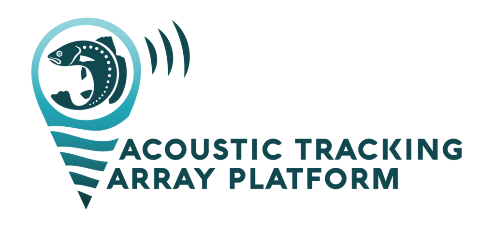
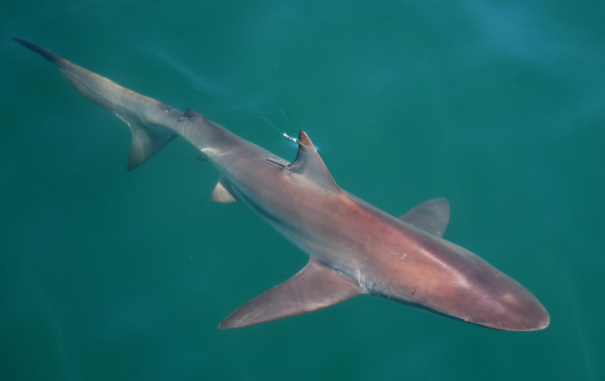

::: {align="center"}
{width="600px"}
:::

Firstly thank you to SAIAB, ATAP and Dr Taryn Murray for hosting and organising logistics for an in person acoustic telemetry workshop.

I should preface that this workshop is not intended to be an exhaustive deep dive into advanced analytical methods or statistical modelling, Rather:

*"I've spent all this time and energy writing proposals, securing permits and ethical clearance, sourcing tags and receivers and overcome calm and rough seas alike to finally tag all my animals, now what?"*

*"How do I show my supervisors/funders/collaborators/parents some tangible results that this has all been worth it"*

As with anything if we break things into small logical steps and harness some useful data science tools we can ensure that our workflows are efficient and repeatable so we don't waste eons searching for the csv that I swear I'd perfected. Therefore, after this workshop, you should be able to work in an R project environment to:

-   Neatly file everything into organised folders 
-   Take your raw detections and metadata and understand the need to clean
-   Apply some basic telemetry principles to further clean your data 
-   Plot and tabulate your data in line with the literature
-   Interrogate individual detection histories to generate insights and start to ask applied questions of your data

We do assume at least a basic working knowledge of R so I won't start from scratch. However, there are some excellent resources within local contexts out there to familiarise yourself with the basics if you need to brush up. 

## The data 

Apologies to the fish and ray people! Today we'll be dealing with sharks cos they're cool too!

During this workshop we'll be using a subset of detection data from five subadult bronze whaler sharks *(Carcharhinus brachyurus)* which were tagged off Port St. Johns, South Africa during the sardine run in 2021. Bronze whalers are a fairly wide-ranging neritic species, found from southern Angola to KZN in South Africa. These sharks were all equipped with coded V16s with no temp/pressure sensors which should transmit for ~10 years. The species are thought to seasonally migrate between summers warm-temperate Western Cape waters to winter subtropical Eastern Cape and KZN waters. Therefore leveraging the coastal network of acoustic receivers that ATAP and collaborators manage could be a hugely valuable tool to try and better understand their movement ecology. 

It is worth remembering that acoustic detections are not direct movement tracks in the same way as GPS positions. Rather, they represent discrete observations of a tagged animal within detection range of a receiver at a particular point in time. On broad-scale coastal arrays, long periods may occur between detections, meaning movements between receivers are inferred rather than directly observed. Therefore acoustic data is often treated as presence-pseudoabsence data unless dense receiver networks which use triangulation are being used. As such, remember this when trying to create joins between receivers or animating 'movement tracks' as this can be misleading. 

## Last word

One final thing before we dive. Increasingly the days of data science and stats forums as well as the trusty youtube expert are dwindling. More so the default is:

*"Can ChatGPT/Claude or any other AI variant do my analysis and write my thesis for me"*

In short no, well at least not ethically. Most universities and institutes have an AI policy so it would be well worth reading up on that before getting carried away. Unlike the forums and youtube of years gone by where you trawled for hours to make sense of things, AI can spit several different versions to you in a manner of seconds. When users understand the fundamentals of their data or analysis, then AI tools can compliment research through efficiency and troubleshooting. However blindly following along could lead to the edge of a cliff and flawed results/interpretation pretty quickly. Through critical thinking and a hands on approach applied research is incredibly rewarding, don't let the machine take that! Interrogate and play with your data (in R of course), it's surprisingly fun.

Enter shark stage left...
